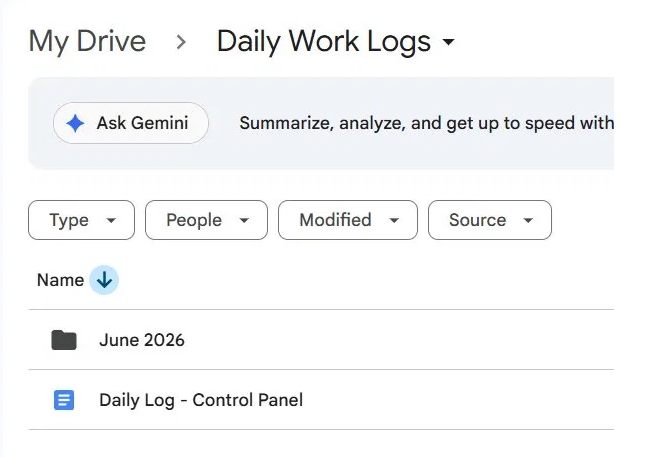
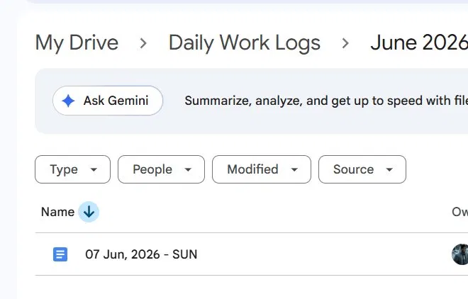

# 📋 Daily Work Log Processor

> **Transform your raw daily notes into a structured, AI-powered personal knowledge base — automatically, every evening.**

Copyright (c) 2026 Gaurav Gaur — ggaur.work@gmail.com
The concept, design, workflow, and implementation of this Daily Work Log Processor were created by Gaurav Gaur (ggaur.work@gmail.com) and first published on GitHub in June 2026. This repository serves as public record of original authorship. No individual or organisation may represent this work or its derivatives as their own original idea.
See [LICENSE](./LICENSE) for terms of use.

---

## 🚀 The Value This Gives You

Most productivity systems fail because they demand too much discipline upfront.
You have to *think* about where to put things, which tab, which format, which category.
That friction kills the habit.

**This tool eliminates that friction entirely.**

You just write. Freely. Bullet points, half-sentences, whatever comes to mind.
One tab. No structure required.

At 9 PM every evening, an AI reads what you wrote and automatically populates:

| Tab | What goes in |
|---|---|
| **Day Summary** | Top wins, one-line summary, highlight of the day |
| **Habits Tracker** | Checkboxes for every habit detected, with score |
| **Learnings** | Books, courses, insights — source + core takeaways |
| **Idea Incubator** | Every idea captured, with status and use cases |
| **Metrics** | Weight, steps, yoga, DSA sessions, books read |

No copy-pasting. No reorganising. No end-of-day admin work.
Just log and sleep. Wake up to a structured day.

Over weeks and months, you accumulate a searchable, structured record of your growth —
habits, ideas, learning, health — all in one place, in Google Docs you already use.

---

## 📸 Folder Structure in Google Drive

This is what your Drive looks like once set up:

**Root folder — Daily Work Logs:**



**Monthly subfolder — June 2026:**



The script automatically creates monthly subfolders (`June 2026`, `July 2026`, etc.)
and places each day's file inside the correct one.

---

## 🛠️ How It Works

```
You log freely into "Manual Log" tab of today's Google Doc
             ↓
   Apps Script reads the tab at 9 PM IST
             ↓
   Gemini AI (gemini-2.5-flash) analyses the log
             ↓
   5 structured tabs auto-populated in the same doc
             ↓
   You wake up to an organised day — zero effort
```

**Manual override always available** via a custom `📋 Daily Log` menu
in the Control Panel Google Doc.

---

## ⚙️ Tech Stack

- **Google Apps Script** — automation engine, runs inside Google's ecosystem
- **Gemini API** (`gemini-2.5-flash`) — AI analysis and structured output
- **Google Docs API** — reads and writes Document Tabs
- **Google Drive API** — folder traversal and daily file creation from template
- **No external servers. No subscriptions. Runs entirely in your Google account.**

---

## 📂 Setup Guide

### Prerequisites
- A Google account
- A free Gemini API key from [aistudio.google.com](https://aistudio.google.com) → Get API Key

---

### Step 1 — Create the Google Drive folder structure

Create a folder called `Daily Work Logs` in your Google Drive.
Inside it, the script will automatically create monthly subfolders.

**Get the ROOT_FOLDER_ID:**
1. Open your `Daily Work Logs` folder in Google Drive
2. Look at the URL in your browser:
   ```
   https://drive.google.com/drive/folders/1nJZm_tYSA0IBegVssRb552G-uQIoagPj
                                           ^^^^^^^^^^^^^^^^^^^^^^^^^^^^^^^^^^^^
                                           This is your ROOT_FOLDER_ID
   ```
3. Copy everything after `/folders/` — that is your `ROOT_FOLDER_ID`

---

### Step 2 — Create the Template Google Doc (do this once)

Create a new Google Doc named `_TEMPLATE — Daily Log`.
Inside it, create **6 Document Tabs** (using the Tabs panel on the left in Google Docs),
named **exactly** as follows:

```
Manual Log
Day Summary
Habits Tracker
Learnings
Idea Incubator
Metrics
```

Leave all tabs empty. This is your daily template.

**Get the TEMPLATE_DOC_ID:**
1. Open your template doc
2. Look at the URL:
   ```
   https://docs.google.com/document/d/1zjrj0uE32biYX5x1tmCMSKDHaPYaN-cPO9rScSTUua4/edit
                                      ^^^^^^^^^^^^^^^^^^^^^^^^^^^^^^^^^^^^^^^^^^^^^^^^^^^^
                                      This is your TEMPLATE_DOC_ID
   ```
3. Copy everything between `/d/` and `/edit` — that is your `TEMPLATE_DOC_ID`

---

### Step 3 — Create the Control Panel Google Doc

Create a new Google Doc named `Daily Log — Control Panel`.
Place it inside your `Daily Work Logs` folder.

This is the one doc that holds the script, the menu, and the triggers.
You never log into this doc — it is purely the control centre.

---

### Step 4 — Add the Apps Script

1. Open `Daily Log — Control Panel`
2. Go to `Extensions → Apps Script`
3. Delete the default `myFunction()` code
4. Paste the full contents of `Code.gs` from this repository
5. Click ⚙️ Project Settings → check **"Show appsscript.json manifest in editor"**
6. Click on `appsscript.json` in the file list and replace its contents with
   the `appsscript.json` from this repository

---

### Step 5 — Set your IDs in the CONFIG block

At the top of `Code.gs`, find the `CONFIG` block and fill in your values:

```javascript
const CONFIG = {
  ROOT_FOLDER_ID:  'paste your ROOT_FOLDER_ID here',
  TEMPLATE_DOC_ID: 'paste your TEMPLATE_DOC_ID here',
  GEMINI_MODEL:    'gemini-2.5-flash',
  ...
};
```

---

### Step 6 — Add your Gemini API Key (securely)

The API key is stored in Script Properties — **never in the code file**.

1. In the Apps Script editor, click ⚙️ **Project Settings** (left sidebar)
2. Scroll down to **Script Properties**
3. Click **Add script property**
4. Property name: `GEMINI_API_KEY`
5. Value: your Gemini API key from [aistudio.google.com](https://aistudio.google.com)
6. Click **Save script properties**

---

### Step 7 — Authorise and activate

1. In the Apps Script editor, select `onOpen` from the function dropdown → click ▶ Run
2. Google will ask for permissions — click **Review Permissions → Allow**
   (you are authorising your own script to access your own Drive and Docs)
3. Go back to the **Control Panel Google Doc** and reload it
4. You will now see a `📋 Daily Log` menu in the top bar
5. Click `📋 Daily Log → ⏰ Setup Evening Auto-Trigger`

---

### Daily workflow (after setup)

```
Morning:
  📋 Daily Log → 🆕 Create Today's File from Template
  Open the new daily doc → log freely into "Manual Log" tab all day

Evening (automatic):
  9 PM IST → script runs → 5 tabs populated automatically

Manual override anytime:
  📋 Daily Log → ▶ Process Today's Log
```

---

## 📄 License

This project uses a dual-tier license. See [LICENSE](./LICENSE) for full terms.

**Free tier (personal use):** CC BY-NC 4.0 — use freely, credit the author,
no commercial use without permission.

**The concept, design, workflow, and implementation of this tool are the
original intellectual property of Gaurav Gaur (ggaur.work@gmail.com).
No individual or organisation may claim ownership or authorship of this
idea or its derivatives.**

**Commercial use:** Requires a separate written agreement.
Write to **ggaur.work@gmail.com** with subject line `Commercial License Inquiry`.

---

## 🤝 Want to Use It Commercially?

If you want to:
- Deploy this for your team or organisation
- Bundle it into a product or course you sell
- Build a business workflow around it
- Get access to the advanced version (custom tab profiles, multi-user support)

Reach out: **ggaur.work@gmail.com**

I am happy to discuss commercial licensing, custom setup, and the roadmap
for the advanced version.

---

## 🗺️ Roadmap (Advanced Version — Coming Soon)

- [ ] Custom tab configuration — choose which tabs to generate
- [ ] User profiles — "Developer Profile", "Side Hustler", "Entrepreneur" etc.
  each with their own default tab set
- [ ] Central dashboard across all daily files
- [ ] Full video walkthrough and documentation

---

*Built with [Claude](https://claude.ai) (Anthropic) | June 2026*
*Idea, design, and implementation — Gaurav Gaur*
